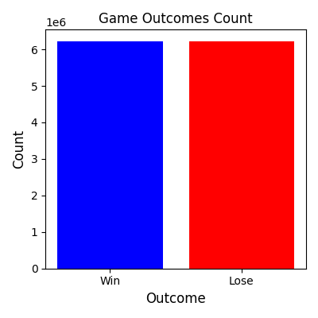
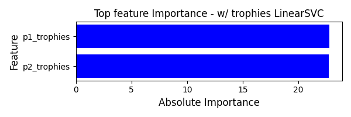
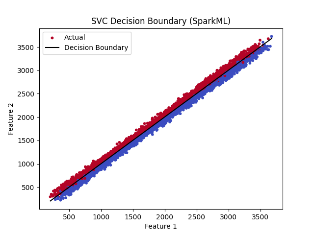
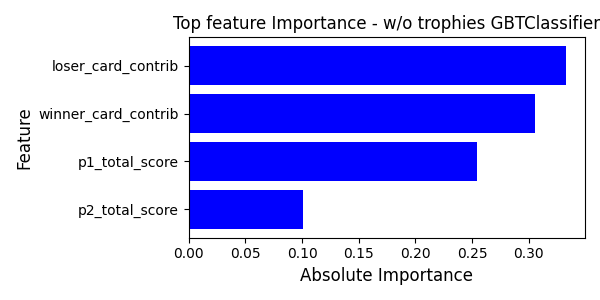

# Big Data and Cloud Computing Final Project

## CLASHIFIER: Predicting Triumphs and Tumbles in Clash Royale

- [View notebook](bdcc_final_project.ipynb)
- [Download HTML Report](bdcc_final_project.html)

## Summary

In this project we explore the prediction of win or loss outcomes in [Clash Royale Datasets](https://www.kaggle.com/datasets?search=clash+royale) based on cards played, providing a net score of the combination of card's strengths, their individual strengths, trophies earned, and other features in the dataset.

## Accuracy by model
### Accuracy to beat based on PCC
Since dataset is well balanced PCC is at 0.5 and the accuracy to beat is 1.25 times PCC which is at 62.5%



Further in the project we have recognized that the `trophies` feature is a high predictor of winning and we would like to omit this feature by removing it and running another iteration of the models

### With trophies as feature
```commandline
Running RandomForestClassifier
Train acc: 0.8654072513471296
Test acc: 0.8557170959024455
Running GBTClassifier
Train acc: 0.9248861517944598
Test acc: 0.9240305191890834
Running LogisticRegression
Train acc: 0.5003408454929403
Test acc: 0.5001353596699802
Running LinearSVC
Train acc: 0.9905794446016212
Test acc: 0.9970660135025449
```
Best Model attained by LinearSVC at around 99.7% accuracy
```commandline
+-----------------------+----------------------+
|Feature                |Importance            |
+-----------------------+----------------------+
|p1_trophies            |-22.806540709791452   |
|p2_trophies            |22.760747227596543    |
|p2_elixir_total        |0.07479796360652341   |
|p1_rarity_rare_cnt     |0.06287011068850294   |
|p2_rarity_common_cnt   |-0.030829607746481292 |
|p1_type_spell_cnt      |0.029102162317612403  |
|p1_rarity_common_cnt   |0.02888257475877359   |
|p2_rarity_legendary_cnt|0.02735697700487782   |
|p2_rarity_rare_cnt     |-0.024698381022189526 |
|p1_score_7             |-0.023470636060177092 |
|p1_rarity_champion_cnt |-0.023328445066155758 |
|p2_rarity_epic_cnt     |-0.021663893361536145 |
|p1_type_troop_cnt      |-0.021454060229230767 |
|p1_rarity_epic_cnt     |0.015090249918683933  |
|p1_elixir_total        |-0.014042262984878115 |
|p2_score_5             |0.013081820962900642  |
|p2_rarity_champion_cnt |0.01298724690164731   |
|p1_score_3             |-0.01238466754244836  |
|p1_score_2             |-0.00972658238947054  |
|p1_total_score         |-0.008806835955398329 |
|p1_score_1             |-0.008232590474288544 |
|p1_score_4             |-0.007876438138993193 |
|p2_type_spell_cnt      |-0.007600613505269464 |
|p2_score_7             |0.007502389748442487  |
|p2_score_3             |0.007034666181438991  |
|p2_type_building_cnt   |0.0066060265343091925 |
|p1_score_6             |-0.005780376099864807 |
|p1_score_5             |-0.005062380979204724 |
|p2_total_score         |0.005018888774309766  |
|p2_score_1             |0.004748500180086208  |
|p2_score_2             |0.004731519506571234  |
|p1_rarity_legendary_cnt|0.004329341410636161  |
|p1_type_building_cnt   |-0.0039218798940825784|
|p2_score_6             |0.003911243624535796  |
|abs_diff_trophies      |0.0032934990792542196 |
|p2_score_4             |0.0015674957811862406 |
|p2_score_8             |-0.0014892835753709593|
|p2_type_troop_cnt      |9.123703934130265E-4  |
|p1_score_8             |-6.956451212099391E-4 |
|loser_trophies         |-1.49178529812622E-4  |
|winner_trophies        |-1.49178529812622E-4  |
|loser_card_contrib     |-1.9723169328573712E-5|
|percent_diff_trophies  |0.0                   |
|p2_is_evolved_false_cnt|0.0                   |
|p2_is_evolved_true_cnt |0.0                   |
|winner_card_contrib    |-0.0                  |
|p1_is_evolved_false_cnt|0.0                   |
|p1_is_evolved_true_cnt |0.0                   |
+-----------------------+----------------------+

Train acc: 0.9905794446016212
Test acc: 0.9970660135025449
```




### Without trophies as feature
```commandline
Running RandomForestClassifier
Train acc: 0.8238213168197294
Test acc: 0.8118935075104324
Running GBTClassifier
Train acc: 0.9460099770699539
Test acc: 0.9427356977110608
Running LogisticRegression
Train acc: 0.5003408454929403
Test acc: 0.5001353596699802
Running LinearSVC
Train acc: 0.5145785143736802
Test acc: 0.5110823044088578
```
Best Model attained by GBTClassifier at around 94.2% accuracy
```commandline
+-----------------------+----------------------+
|Feature                |Importance            |
+-----------------------+----------------------+
|loser_card_contrib     |0.3330421474050917    |
|winner_card_contrib    |0.3054412288191111    |
|p1_total_score         |0.25404485705884905   |
|p2_total_score         |0.10046825733974983   |
|p2_score_6             |0.005289579649328246  |
|p2_score_8             |7.909567679504799E-4  |
|p2_score_2             |4.6339420926307025E-4 |
|p1_score_8             |1.686172161717989E-4  |
|p1_score_2             |1.0342193426199028E-4 |
|p1_score_4             |6.711737003262856E-5  |
|p1_score_6             |4.942091592921426E-5  |
|p1_type_building_cnt   |2.889810970064493E-5  |
|p1_type_troop_cnt      |2.3263395914186676E-5 |
|p2_score_4             |1.8839808645973418E-5 |
|p1_rarity_rare_cnt     |7.00592010065468E-17  |
|p1_rarity_epic_cnt     |4.2723963619599335E-17|
|p1_rarity_champion_cnt |7.390638256470977E-18 |
|percent_diff_trophies  |5.770772337244461E-18 |
|winner_trophies        |5.315185047462005E-18 |
|p2_rarity_legendary_cnt|3.0878694085255424E-18|
|p2_type_spell_cnt      |8.151668250978188E-19 |
|p2_rarity_rare_cnt     |2.08860275535035E-19  |
|p1_rarity_legendary_cnt|0.0                   |
|p1_elixir_total        |0.0                   |
|p2_type_building_cnt   |0.0                   |
|p1_rarity_common_cnt   |0.0                   |
|p2_is_evolved_true_cnt |0.0                   |
|p2_rarity_epic_cnt     |0.0                   |
|p1_is_evolved_true_cnt |0.0                   |
|p1_score_5             |0.0                   |
|p2_is_evolved_false_cnt|0.0                   |
|p2_type_troop_cnt      |0.0                   |
|p2_score_1             |0.0                   |
|p1_score_1             |0.0                   |
|p1_score_3             |0.0                   |
|p2_score_7             |0.0                   |
|p1_type_spell_cnt      |0.0                   |
|p1_score_7             |0.0                   |
|p2_rarity_champion_cnt |0.0                   |
|abs_diff_trophies      |0.0                   |
|p2_score_5             |0.0                   |
|p2_elixir_total        |0.0                   |
|p2_rarity_common_cnt   |0.0                   |
|p2_score_3             |0.0                   |
|p1_is_evolved_false_cnt|0.0                   |
|loser_trophies         |0.0                   |
+-----------------------+----------------------+
```


## Conclusion
To conclude, our analysis reveals that player ratings, as reflected by trophies, play a significant role in predicting match outcomes, but when removed, the sum of the netscore emerged as the next best predictor. These insights emphasize the need to consider both individual player performance and strategic deck-building when evaluating and predicting competitive match results.